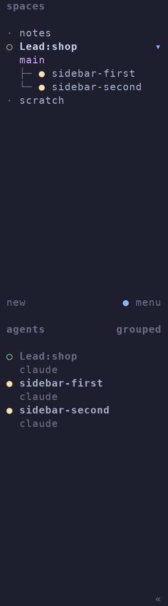

# Lead and repository Rider sidebar proof

The image is rasterized from the ANSI frame of a real Herdr 0.9.1 client attached to the isolated E2E server. The fixture removes inherited `HERDR_*` values and places Herdr configuration and `POSSE_HOME` under its temporary test root. No User session or configuration was changed.



Before the fix, the same end-to-end flow reported:

```text
Lead sidebar metadata: harness="Lead" title="Lead: shop" row="Lead:shop"
native workspace order: [notes Lead:shop scratch sidebar-first sidebar-second]
```

After the fix, the grouped Agents panel renders:

```text
Lead:shop
  claude
sidebar-first
  claude
sidebar-second
  claude
```

Spaces retain native worktree tree grouping. Agents remain flat; priority sorting, custom agent views and other agents in the Lead workspace can override adjacency. Repository Rider names occur once, without the redundant `posse_row` name that previously truncated them in the optional Posse layout.

## Verification

- `go test -race -count=1 ./...`: passed, including `lead_missing`, reused-ID guards and unchanged Identity metadata.
- `go test -tags=e2e -count=1 ./internal/e2e`: passed, including restart recovery, group-close recovery, legacy tabs and foreign-pane Teardown.
- `go test -tags=e2e ./internal/e2e -run '^TestLeadHarnessAndRepositoryRiderSidebar$' -count=5 -v`: passed all five runs. Covers live rendering, stale metadata/placement reconciliation, User labels/order/focus and child-only Teardown.
- `go test -tags='e2e perf' -count=1 ./internal/e2e -run '^TestCommandPerformanceBudgets$'`: passed.
- `go vet -tags=e2e,perf ./...` and `go run honnef.co/go/tools/cmd/staticcheck@2026.2.1 -tags=e2e,perf ./...`: passed.

The first full-suite capture exposed a test race: the initial client frame was empty before its server snapshot arrived. The capture assertion now replays sparse cursor updates, with a deterministic regression test, rather than inspecting that bootstrap frame.

## Risk and rollback

Only identified linked Rider workspaces move. Their order and the relative order of other workspaces remain unchanged. A stale or unsupported move logs a presentation failure and does not block work; the next reconciliation retries. Pane IDs, Mount ownership, Teardown, Profiles, Dispatch Rules, Remuda, Landing Mode and Identity rules are unchanged.

Revert the fix and restart Posse to roll back code behavior. There is no configuration or database migration. Existing metadata/order persist in Herdr until reconciled or manually rearranged; a rollback does not close panes or remove Mounts.
